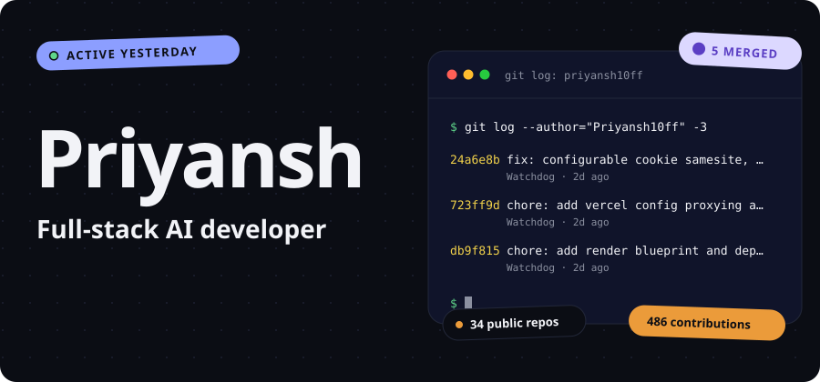
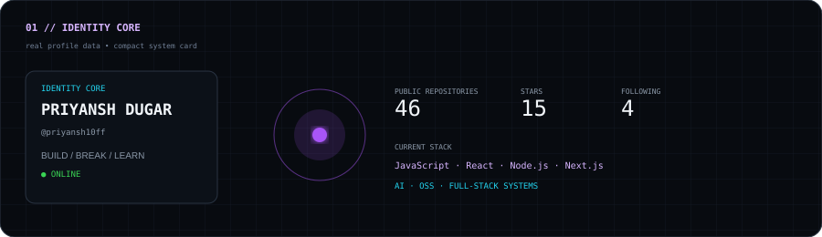
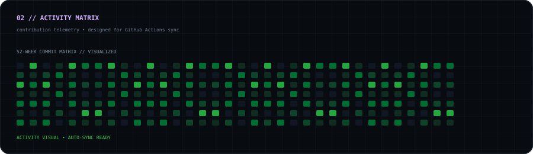
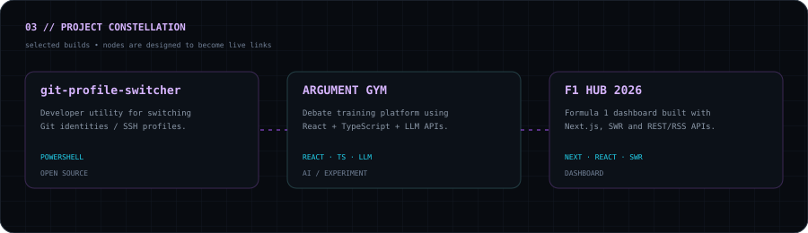
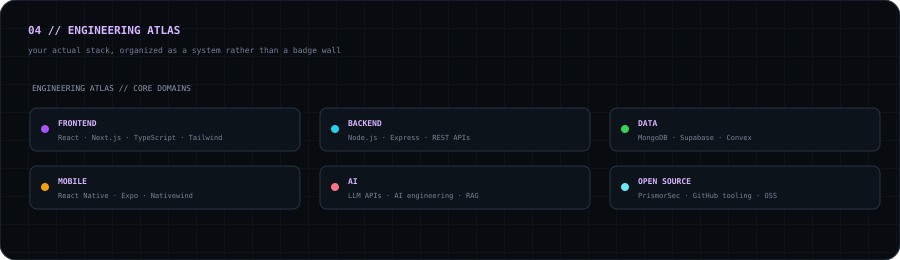
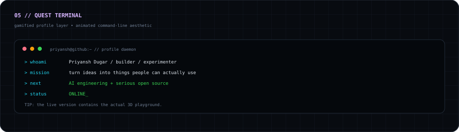

<div align="center">

<a href="https://priyansh10ff.github.io/priyansh10ff/">

</a>

<br/>

<a href="https://priyansh10ff.github.io/priyansh10ff/">⚡ ENTER INTERACTIVE PROFILE</a>
&nbsp;&nbsp;·&nbsp;&nbsp;
<a href="https://github.com/priyansh10ff">GITHUB</a>
&nbsp;&nbsp;·&nbsp;&nbsp;
<a href="https://www.linkedin.com/in/priyansh-dugar-709333363">LINKEDIN</a>

</div>

<br/>

<div align="center">




</div>

<br/>

<div align="center">



</div>

<br/>

<div align="center">



</div>

<br/>

<div align="center">



</div>

<details>
<summary><b>ACCESS // RAW PROFILE DATA</b></summary>

```text
PLAYER      PRIYANSH DUGAR
HANDLE      @priyansh10ff
MODE        BUILD / BREAK / LEARN
AGE         19
REPOS       46
STARS       15
FOLLOWING   4

CORE        JavaScript · React · Node.js · Next.js
CURRENT     Full-stack systems · AI engineering · Open source
```

</details>

<div align="center">

### `BUILD → BREAK → LEARN → SHIP → REPEAT`

</div>
